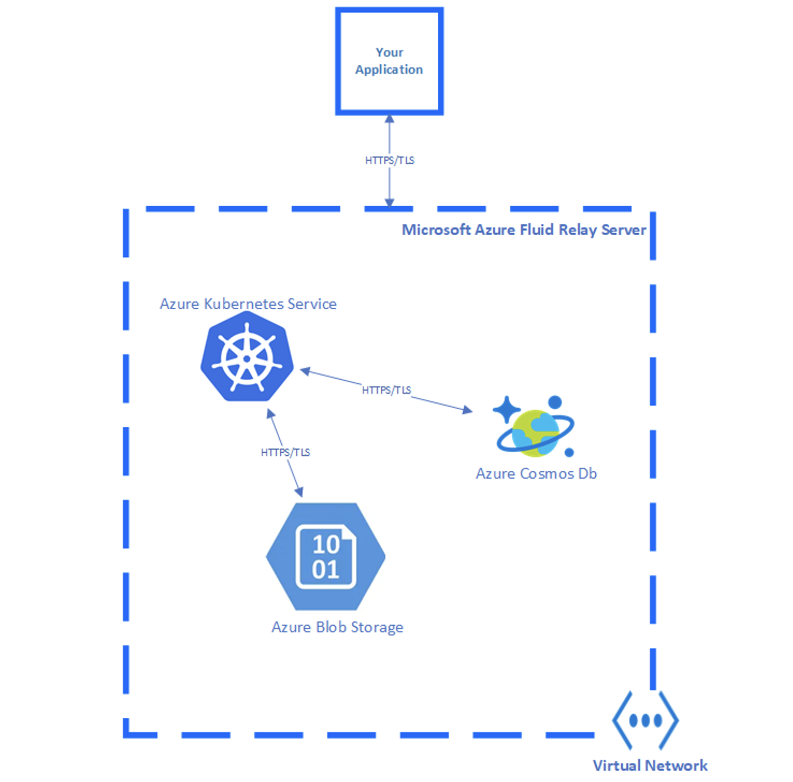

# Data encryption in Microsoft Azure Fluid Relay Server

Encryption at rest is a phrase that commonly refers to the encryption of data on nonvolatile storage devices, such as solid-state drives (SSDs) and hard disk drives (HDDs). Microsoft Azure Fluid Relay Server hosts its services using Azure Kubernetes Service, and it persists the data in Azure Cosmos DB and Azure Blob Storage.  

 
The diagram below shows at a high level how Azure Fluid Relay Server is implemented and how it handles data storage.

Microsoft Azure Fluid Relay Server leverages the encryption-at-rest capability of [Azure Kubernetes](https://docs.microsoft.com/en-us/azure/aks/enable-host-encryption), [Microsoft Azure Cosmos DB](https://docs.microsoft.com/en-us/azure/cosmos-db/database-encryption-at-rest) and [Azure Blob Storage](https://docs.microsoft.com/en-us/azure/storage/common/storage-service-encryption). The service-to-service communication between AFRS and these resources is TLS encrypted and is enclosed in with the Azure Virtual Network Boundary, protected from external interference by Network Security Rules.

## Frequently asked questions

### Q: How much more does Azure Fluid Relay Server cost if Encryption is enabled?
A: Encryption-at-rest is enabled by default. There is no additional cost.
### Q: Who manages the encryption keys?
A: The keys are managed by Microsoft.
### Q: How often are encryption keys rotated?
A: Microsoft has a set of internal guidelines for encryption key rotation, which Azure Fluid Relay Server follows. The specific guidelines are not published. Microsoft does publish the [Security Development Lifecycle (SDL)](https://www.microsoft.com/sdl/default.aspx), which is seen as a subset of internal guidance and has useful best practices for developers.
### Q: Can I use my own encryption keys?
A: No, this feature is not available yet. Keep an eye out for more updates on this. 
### Q: What regions have encryption turned on?
A: All Azure Fluid Relay Server regions have encryption turned on for all user data.
### Q: Does encryption affect the performance latency and throughput SLAs?
A: There is no impact or changes to the performance SLAs with encryption at rest enabled.